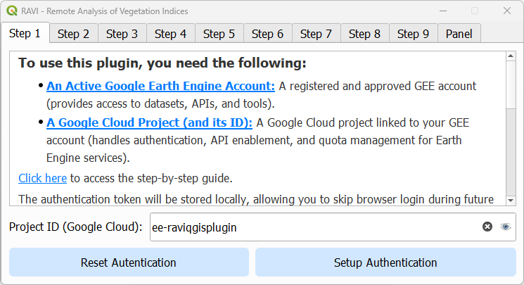

# RAVI - Remote Analysis of Vegetation Indices

This repository contains the source code for the **RAVI** plugin for QGIS, which integrates with Google Earth Engine (GEE) to process and visualize geospatial data using the Sentinel-2 harmonized surface reflectance catalog. RAVI is a viable tool for students, researchers, farmers, and GIS professionals working in agriculture, land monitoring, or environmental management.

## Documentation

An interactive version of the documentation is available via GitHub Pages here:  
[https://caioarantes.github.io/ravi-qgis-plugin/](https://caioarantes.github.io/ravi-qgis-plugin/)  

You can also view the complete documentation in both languages below:

---

  
<strong>English Documentation</strong>

### Overview

RAVI is a QGIS plugin designed to seamlessly integrate with Google Earth Engine (GEE), enabling efficient processing and visualization of geospatial data. Using the Sentinel-2 harmonized surface reflectance catalog, the plugin supports vegetation index calculations and the easy download of multispectral imagery. It is a viable tool for students, researchers, farmers, and GIS professionals working in agriculture, land monitoring, or environmental management.

### Key Features

- **Earth Engine Integration**
  - *Easy Authentication:* Authenticate with Google Earth Engine to enable plugin functionality.
  - *Direct Processing:* Access, process, and analyze Sentinel-2 imagery without leaving QGIS.
  - *On-the-Fly Visualization:* Visualize processed data as raster layers or interactive plots.
- **Vegetation Index Calculations**
  - *Supported Indices:* Compute indices such as NDVI, EVI, SAVI, and GNDVI.
  - *Customizable Metrics:* Aggregate data using mean, max, min, median, amplitude, or standard deviation.
- **Advanced Time Series Analysis**
  - Generate time series for vegetation indices over a defined Area of Interest (AOI).
  - Integrate precipitation data from NASA POWER for cross-variable comparisons.
  - Smooth data with Savitzky-Golay filters for enhanced trend analysis.
- **AOI Selection**
  - *AOI Management:* Load areas of interest from shapefiles or GeoJSON files.
- **Interactive Visualization**
  - *Charts:* Create interactive time series plots using Plotly.
  - *Raster Styling:* Apply predefined color ramps (e.g., RdYlGn) for visual clarity.
  - *Export Options:* Export processed data as GeoTIFFs, CSVs, or styled rasters.
- **Comprehensive Imagery Management**
  - *Date Filtering:* Filter individual images by acquisition date.
  - *Cloud Filtering:* Exclude or mask cloudy pixels while preserving usable data.
  - *Composite Creation:* Generate composite images based on user-defined metrics.

### Installation

To install RAVI:

1. Open QGIS and navigate to the **Plugins** menu.
2. Select **Manage and Install Plugins**.
3. In the plugin repository settings, enable **Show also experimental plugins**.  
   
4. In the "All" tab, search for **RAVI**, select it, and click **Install**.
5. Ensure that RAVI is checked in the installed plugins list.
6. Restart QGIS.

### Usage

**Step 1: Authentication**  
  
- Open the plugin dialog.  
- Authenticate with Google Earth Engine using your credentials.

**Step 2: Select Output Folder**  
  
- Choose the folder where you want to save the output files.

**Step 3: Load and Select the Area of Interest (AOI)**  
  
- Select an AOI by loading a shapefile or GeoJSON file.  
- Ensure the geometry is valid (Polygon or MultiPolygon only).  
- Add a Google Maps layer to the QGIS canvas for better visualization and context.  
- Use the **Build AOI from Canvas Extent** button to automatically generate a new AOI based on the current canvas extent.

**Step 4: Define Time Range for Imagery Search**  
  
- Set a custom time range or select a suggested one.

**Step 5: Select Vegetation Index for Time Series Analysis**  
  
- Choose the vegetation index you want to analyze from the dropdown menu.

**Steps 6 to 9: Additional Filters**  
Configure filters such as imagery overlap, AOI buffer, cloud pixel percentage, and valid pixel percentage according to your analysis requirements. *(Images for steps 6, 7, 8, and 9 are provided in the documentation.)*

### Results Page

The results page includes the following features:

### 1. Time Series Plot

- Visualize the time series of the selected vegetation index over the defined AOI.
- Hover over the plot to see specific values and dates for detailed analysis.

### 2. Load RGB Layer (Focus on a Day)

- Load and display an RGB layer for a specific date to analyze the visual appearance of the area. All spectral bands are downloaded, and the band numbers correspond to the Sentinel-2 bands as listed in the table below:

| Sentinel-2 Band Name         | QGIS Band Number | Wavelength (nm) | Spatial Resolution (m) |
|------------------------------|------------------|-----------------|------------------------|
| Band 1 (Coastal aerosol)     | 1                | 443             | 60                     |
| Band 2 (Blue)                | 2                | 490             | 10                     |
| Band 3 (Green)               | 3                | 560             | 10                     |
| Band 4 (Red)                 | 4                | 665             | 10                     |
| Band 5 (Vegetation Red Edge) | 5                | 705             | 20                     |
| Band 6 (Vegetation Red Edge) | 6                | 740             | 20                     |
| Band 7 (Vegetation Red Edge) | 7                | 783             | 20                     |
| Band 8 (NIR)                 | 8                | 842             | 10                     |
| Band 8A (Vegetation Red Edge)| 9                | 865             | 20                     |
| Band 9 (Water Vapour)        | 10               | 945             | 60                     |
| Band 10 (SWIR - Cirrus)      | 11               | 1375            | 60                     |
| Band 11 (SWIR)               | 12               | 1610            | 20                     |
| Band 12 (SWIR)               | 13               | 2190            | 20                     |

### 3. Load Index Layer (Focus on a Day)

- Load and display a vegetation index layer for a specific date.

### 4. Load Index Layer (Composite Image)

- Generate and display a composite image based on the selected vegetation index and the user-defined metric.
- The composite image will include all images within the current date selection. Use the date selection tool to filter out specific dates.

### 5. Date Selection Tool

- Use the date selection tool to filter and select specific dates for analysis.
- The date selection tool updates the time series plot
- Composite images are based on all selected dates.

### 6. Savitzky-Golay Filter

- Apply the Savitzky-Golay filter to smooth the time series data for enhanced trend analysis.
- The parameters for the Savitzky-Golay algorithm, such as the order of the polynomial and the window length, can be adjusted as needed to fine-tune the smoothing process.

### 7. Save Options

- Save the time series data in spreasheet format (CSV).
- To save the time series as image, open it in the browser to enable the download option.

### 8. NASA POWER Precipitation

- Add monthly precipitation data from NASA POWER for cross-variable comparisons.
- Save the precipitation data in spreasheet format (CSV).

### 9. Quickly Run New Time Series

- Quickly run a new time series analysis by changing the Area of Interest (AOI), Vegetation Index, or time range.

### 10. Clear All Loaded Layers

- Clear all loaded layers from the layer panel to start a new analysis or to declutter the workspace.

## Troubleshooting
- **Earth Engine Authentication Failed**: Ensure you have the necessary requirements as explained in the authentication tab.
- **AOI Errors**: Verify the AOI file is valid and has a valid CRS (EPSG:4326 preferred).

## Reporting Issues
If you encounter any issues or have suggestions for improvements, please open an issue in the [GitHub Issues](https://github.com/caioarantes/ravi-qgis-plugin/issues) section.

## Contribute to the Project
Contributions are welcome! Please visit the [GitHub repository](https://github.com/caioarantes/ravi-qgis-plugin) to get started.

## License
RAVI is licensed under the GNU General Public License v2.0 or later. Refer to the [LICENSE](https://github.com/caioarantes/ravi-qgis-plugin/blob/main/LICENSE) file for details.

---

  
<strong>Documentação em Português</strong>

### Visão Geral

RAVI é um plugin do QGIS projetado para integrar-se ao Google Earth Engine (GEE), permitindo o processamento e a visualização eficiente de dados geoespaciais. Utilizando o catálogo de reflectância de superfície harmonizada do Sentinel-2, o plugin suporta cálculos de índices de vegetação e o download fácil de imagens multiespectrais, tornando-o uma ferramenta viável para estudantes, pesquisadores, agricultores e profissionais de GIS que atuam em áreas como agricultura, monitoramento de terras ou gestão ambiental.

### Principais Funcionalidades

- **Integração com Earth Engine**
  - *Autenticação Fácil:* Autentique-se no Google Earth Engine para habilitar a funcionalidade do plugin.
  - *Processamento Direto:* Acesse, processe e analise imagens do Sentinel-2 sem sair do QGIS.
  - *Visualização Imediata:* Visualize os dados processados como camadas raster ou gráficos interativos.
- **Cálculos de Índices de Vegetação**
  - *Índices Suportados:* Calcule índices como NDVI, EVI, SAVI e GNDVI.
  - *Métricas Personalizáveis:* Agregue dados utilizando médias, máximos, mínimos, medianas, amplitude ou desvio padrão.
- **Análise Avançada de Séries Temporais**
  - Gere séries temporais para os índices de vegetação sobre uma Área de Interesse (AOI) definida.
  - Integre dados de precipitação da NASA POWER para comparações entre variáveis.
  - Suavize os dados com filtros de Savitzky-Golay para uma melhor análise de tendências.
- **Seleção de AOI**
  - *Gerenciamento de AOI:* Carregue áreas de interesse a partir de arquivos shapefile ou GeoJSON.
- **Visualização Interativa**
  - *Gráficos:* Crie gráficos de séries temporais interativos utilizando Plotly.
  - *Estilização de Raster:* Aplique rampas de cores predefinidas (por exemplo, RdYlGn) para melhor visualização.
  - *Opções de Exportação:* Exporte os dados processados como GeoTIFFs, CSVs ou rasters estilizados.
- **Gerenciamento Abrangente de Imagens**
  - *Filtragem por Data:* Filtre imagens individuais por data de aquisição.
  - *Filtragem por Nuvens:* Exclua ou mascare pixels nublados, preservando dados utilizáveis.
  - *Criação de Compostas:* Gere imagens compostas baseadas em métricas definidas pelo usuário.

### Instalação

Para instalar o RAVI:

1. Abra o QGIS e navegue até o menu **Plugins**.
2. Selecione **Gerenciar e Instalar Plugins**.
3. Nas configurações do repositório de plugins, habilite **Mostrar também plugins experimentais**.  
   
4. Na aba "Todos", pesquise por **RAVI**, selecione-o e clique em **Instalar**.
5. Certifique-se de que o RAVI está marcado na lista de plugins instalados.
6. Reinicie o QGIS.

### Uso

**Passo 1: Autenticação**  
  
- Abra o diálogo do plugin.  
- Autentique-se no Google Earth Engine utilizando suas credenciais.

**Passo 2: Selecionar Pasta de Saída**  
  
- Escolha a pasta onde deseja salvar os arquivos de saída.

**Passo 3: Carregar e Selecionar a Área de Interesse (AOI)**  
  
- Selecione uma AOI carregando um arquivo shapefile ou GeoJSON.  
- Certifique-se de que a geometria é válida (apenas Polygon ou MultiPolygon).  
- Adicione uma camada do Google Maps ao canvas do QGIS para melhor visualização e contexto.  
- Use o botão **Build AOI from Canvas Extent** para gerar automaticamente uma nova AOI com base na extensão atual do canvas.

**Passo 4: Definir o Intervalo de Tempo para Busca de Imagens**  
  
- Defina um intervalo de tempo personalizado ou selecione um sugerido.

**Passo 5: Selecionar o Índice de Vegetação para a Análise de Séries Temporais**  
  
- Escolha o índice de vegetação que deseja analisar a partir do menu dropdown.

**Passos 6 a 9: Filtros Adicionais**  
Configure os filtros, como sobreposição de imagens, buffer da AOI, porcentagem de pixels nublados e porcentagem de pixels válidos, conforme necessário para a análise. *(Veja as imagens para detalhes.)*

### Página de Resultados

A página de resultados inclui os seguintes recursos:

- **Gráfico de Séries Temporais**  
- **Carregar Camada RGB (Foco em um Dia)**  
- **Carregar Camada de Índice (Foco em um Dia)**  
- **Carregar Camada de Índice (Imagem Composta)**  
- **Ferramenta de Seleção de Datas**  
- **Filtro Savitzky-Golay**  
- **Opções de Salvamento**  
- **Precipitação NASA POWER**  
- **Execução Rápida de Nova Série Temporal**  
- **Limpeza de Todas as Camadas Carregadas**

### Solução de Problemas

- **Falha na Autenticação do Earth Engine:** Certifique-se de atender aos requisitos necessários.
- **Erros na AOI:** Verifique se o arquivo de AOI é válido e possui um CRS válido (preferencialmente EPSG:4326).

### Reportar Problemas

Caso encontre algum problema ou tenha sugestões de melhoria, por favor, abra uma issue na nossa página de [GitHub Issues](https://github.com/caioarantes/ravi-qgis-plugin/issues).

### Contribua para o Projeto

Contribuições são bem-vindas! Visite nosso [repositório no GitHub](https://github.com/caioarantes/ravi-qgis-plugin) para mais informações.

### Licença

O RAVI é licenciado sob a [GNU General Public License v2.0 ou posterior](LICENSE).

