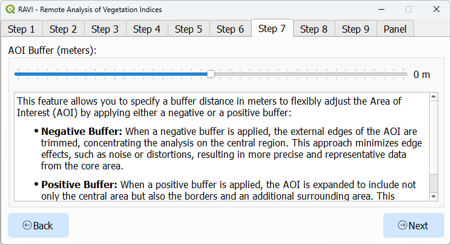
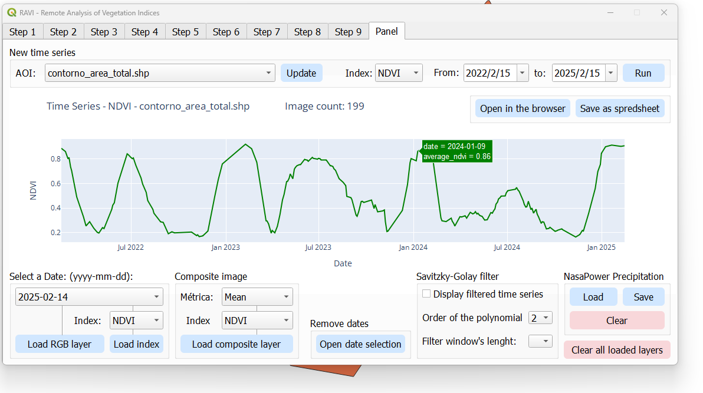
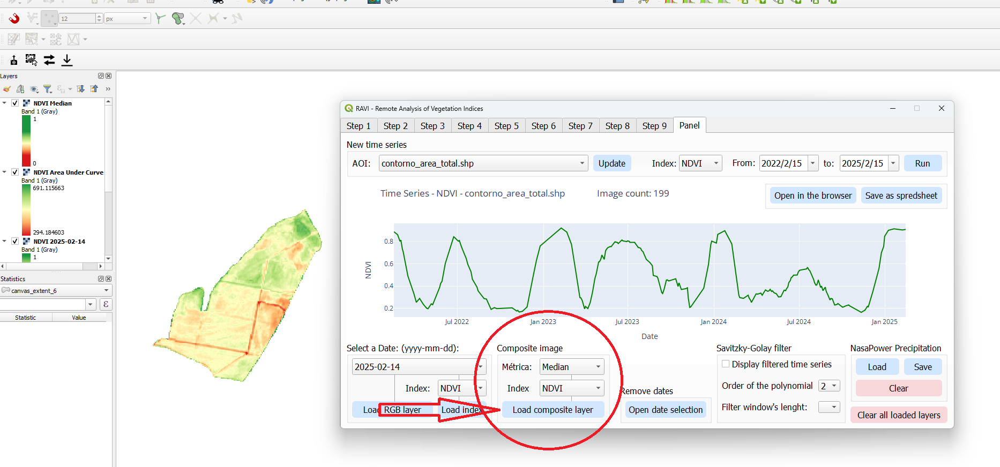

<!-- Botões de alternância de idioma e CSS para exibir/ocultar conteúdos -->

<!-- Inputs de rádio (ocultos) e seus labels atuando como botões -->
<input type="radio" id="englishRadio" name="language" checked>
<label for="englishRadio" class="toggle-btn">English</label>

<input type="radio" id="portugueseRadio" name="language">
<label for="portugueseRadio" class="toggle-btn">Português</label>

<!-- Conteúdo em inglês -->

# RAVI - Remote Analysis of Vegetation Indices

**Overview:**  
RAVI is a QGIS plugin designed to seamlessly integrate with Google Earth Engine (GEE), enabling efficient processing and visualization of geospatial data. Using the Sentinel-2 harmonized surface reflectance catalog, the plugin supports vegetation index calculations and the easy download of multispectral imagery. It is a viable tool for students, researchers, farmers, and GIS professionals working in agriculture, land monitoring, or environmental management.

### Key Features

1. **Earth Engine Integration**
   - **Easy Authentication:** Authenticate with Google Earth Engine to enable plugin functionality.
   - **Direct Processing:** Access, process, and analyze Sentinel-2 imagery without leaving QGIS.
   - **On-the-Fly Visualization:** Visualize processed data as raster layers or interactive plots.

2. **Vegetation Index Calculations**
   - **Supported Indices:** Compute indices such as NDVI, EVI, SAVI, and GNDVI.
   - **Customizable Metrics:** Aggregate data using mean, max, min, median, amplitude, or standard deviation.

3. **Advanced Time Series Analysis**
   - Generate time series for vegetation indices over a defined Area of Interest (AOI).
   - Integrate precipitation data from NASA POWER for cross-variable comparisons.
   - Smooth data with Savitzky-Golay filters for enhanced trend analysis.

4. **AOI Selection**
   - **AOI Management:** Load areas of interest from shapefiles or GeoJSON files.

5. **Interactive Visualization**
   - **Charts:** Create interactive time series plots using Plotly.
   - **Raster Styling:** Apply predefined color ramps (e.g., RdYlGn) for visual clarity.
   - **Export Options:** Export processed data as GeoTIFFs, CSVs, or styled rasters.

6. **Comprehensive Imagery Management**
   - **Date Filtering:** Filter individual images by acquisition date.
   - **Cloud Filtering:** Exclude or mask cloudy pixels while preserving usable data.
   - **Composite Creation:** Generate composite images based on user-defined metrics.

### Installation

To install RAVI:

1. Open QGIS and navigate to the **Plugins** menu.
2. Select **Manage and Install Plugins**.
3. In the plugin repository settings, enable **Show also experimental plugins**.  
   
4. In the "All" tab, search for "RAVI", select it, and click **Install**.
5. Ensure that RAVI is checked in the installed plugins list.
6. Restart QGIS.

### Usage

#### Step 1: Authentication

- Open the plugin dialog.
- Authenticate with Google Earth Engine using your credentials.

#### Step 2: Select Output Folder

- Choose the folder where you want to save the output files.

#### Step 3: Load and Select the Area of Interest (AOI)

- Select an AOI by loading a shapefile or GeoJSON file.
- Ensure the geometry is valid (Polygon or MultiPolygon only).
- Add a Google Maps layer to the QGIS canvas for better visualization and context.
- Use the **Build AOI from Canvas Extent** button to automatically generate a new AOI based on the current canvas extent.

#### Step 4: Define Time Range for Imagery Search

- Set a custom time range or select a suggested one.

#### Step 5: Select Vegetation Index for Time Series Analysis

- Choose the vegetation index you want to analyze from the dropdown menu.

#### Step 6: Imagery Overlap Filter and AOI Buffer Filter Options

- Set the specified filter according to your analysis requirements.

#### Step 7: AOI Buffer

- Use the AOI Buffer filter to reduce the AOI boundary for analysis.

#### Step 8: Cloud Pixel Percentage Filter

- Set the specified filter according to your analysis requirements.

#### Step 9: Valid Pixel Percentage Filter

- Set the specified filter according to your analysis requirements.

### Results Page

The results page includes the following features:

1. **Time Series Plot**  
     
   - Visualize the time series of the selected vegetation index over the defined AOI.
   - Hover over the plot to see specific values and dates for detailed analysis.

2. **Load RGB Layer (Focus on a Day)**  
     
   - Load and display an RGB layer for a specific date to analyze the visual appearance of the area. All spectral bands are downloaded, and the band numbers correspond to the Sentinel-2 bands as listed in the table below:

   | Sentinel-2 Band Name         | QGIS Band Number | Wavelength (nm) | Spatial Resolution (m) |
   |------------------------------|------------------|-----------------|------------------------|
   | Band 1 (Coastal aerosol)     | 1                | 443             | 60                     |
   | Band 2 (Blue)                | 2                | 490             | 10                     |
   | Band 3 (Green)               | 3                | 560             | 10                     |
   | Band 4 (Red)                 | 4                | 665             | 10                     |
   | Band 5 (Vegetation Red Edge) | 5                | 705             | 20                     |
   | Band 6 (Vegetation Red Edge) | 6                | 740             | 20                     |
   | Band 7 (Vegetation Red Edge) | 7                | 783             | 20                     |
   | Band 8 (NIR)                 | 8                | 842             | 10                     |
   | Band 8A (Vegetation Red Edge)| 9                | 865             | 20                     |
   | Band 9 (Water Vapour)        | 10               | 945             | 60                     |
   | Band 10 (SWIR - Cirrus)      | 11               | 1375            | 60                     |
   | Band 11 (SWIR)               | 12               | 1610            | 20                     |
   | Band 12 (SWIR)               | 13               | 2190            | 20                     |

3. **Load Index Layer (Focus on a Day)**  
     
   - Load and display a vegetation index layer for a specific date.

4. **Load Index Layer (Composite Image)**  
     
   - Generate and display a composite image based on the selected vegetation index and the user-defined metric.
   - The composite image will include all images within the current date selection. Use the date selection tool to filter out specific dates.

5. **Date Selection Tool**  
     
   - Use the date selection tool to filter and select specific dates for analysis.
   - The date selection tool updates the time series plot.
   - Composite images are based on all selected dates.

6. **Savitzky-Golay Filter**  
     
   - Apply the Savitzky-Golay filter to smooth the time series data for enhanced trend analysis.
   - The parameters for the Savitzky-Golay algorithm, such as the order of the polynomial and the window length, can be adjusted as needed.

7. **Save Options**  
     
   - Save the time series data in spreadsheet format (CSV).  
     
   - To save the time series as an image, open it in the browser to enable the download option.

8. **NASA POWER Precipitation**  
     
   - Add monthly precipitation data from NASA POWER for cross-variable comparisons.
   - Save the precipitation data in spreadsheet format (CSV).

9. **Quickly Run New Time Series**  
     
   - Quickly run a new time series analysis by changing the Area of Interest (AOI), Vegetation Index, or time range.

10. **Clear All Loaded Layers**  
      
    - Clear all loaded layers from the layer panel to start a new analysis or to declutter the workspace.

### Troubleshooting

- **Earth Engine Authentication Failed:** Ensure you have the necessary requirements as explained in the authentication tab.
- **AOI Errors:** Verify the AOI file is valid and has a valid CRS (EPSG:4326 preferred).

### Reporting Issues

If you encounter any issues or have suggestions for improvements, please open an issue in the [GitHub Issues](https://github.com/caioarantes/ravi-qgis-plugin/issues) section.

### Contribute to the Project

Contributions are welcome! Please visit the [GitHub repository](https://github.com/caioarantes/ravi-qgis-plugin) to get started.

### License

RAVI is licensed under the GNU General Public License v2.0 or later. Refer to the [LICENSE](https://github.com/caioarantes/ravi-qgis-plugin/blob/main/LICENSE) file for details.

<!-- Conteúdo em português -->

# RAVI - Remote Analysis of Vegetation Indices

**Visão Geral:**  
RAVI é um plugin do QGIS projetado para integrar-se ao Google Earth Engine (GEE), permitindo o processamento e a visualização eficiente de dados geoespaciais. Utilizando o catálogo de reflectância de superfície harmonizada do Sentinel-2, o plugin suporta cálculos de índices de vegetação e o download fácil de imagens multiespectrais, tornando-o uma ferramenta viável para estudantes, pesquisadores, agricultores e profissionais de GIS que trabalham com agricultura, monitoramento de terras ou gestão ambiental.

### Principais Funcionalidades

1. **Integração com Earth Engine**
   - **Autenticação Fácil:** Autentique-se no Google Earth Engine para habilitar a funcionalidade do plugin.
   - **Processamento Direto:** Acesse, processe e analise imagens do Sentinel-2 sem sair do QGIS.
   - **Visualização Imediata:** Visualize os dados processados como camadas raster ou gráficos interativos.

2. **Cálculos de Índices de Vegetação**
   - **Índices Suportados:** Calcule índices como NDVI, EVI, SAVI e GNDVI.
   - **Métricas Personalizáveis:** Agregue os dados utilizando médias, máximos, mínimos, medianas, amplitude ou desvio padrão.

3. **Análise Avançada de Séries Temporais**
   - Gere séries temporais para os índices de vegetação sobre uma Área de Interesse (AOI) definida.
   - Integre dados de precipitação da NASA POWER para comparações entre variáveis.
   - Suavize os dados com filtros de Savitzky-Golay para uma melhor análise de tendências.

4. **Seleção de AOI**
   - **Gerenciamento de AOI:** Carregue áreas de interesse a partir de arquivos shapefile ou GeoJSON.

5. **Visualização Interativa**
   - **Gráficos:** Crie gráficos de séries temporais interativos utilizando Plotly.
   - **Estilização de Raster:** Aplique rampas de cores predefinidas (por exemplo, RdYlGn) para melhor visualização.
   - **Opções de Exportação:** Exporte os dados processados como GeoTIFFs, CSVs ou rasters estilizados.

6. **Gerenciamento Abrangente de Imagens**
   - **Filtragem por Data:** Filtre imagens individuais por data de aquisição.
   - **Filtragem por Nuvens:** Exclua ou mascare pixels nublados, preservando os dados utilizáveis.
   - **Criação de Compostas:** Gere imagens compostas baseadas em métricas definidas pelo usuário.

### Instalação

Para instalar o RAVI:

1. Abra o QGIS e navegue até o menu **Plugins**.
2. Selecione **Gerenciar e Instalar Plugins**.
3. Nas configurações do repositório de plugins, habilite **Mostrar também plugins experimentais**.  
   
4. Na aba "Todos", pesquise por "RAVI", selecione-o e clique em **Instalar**.
5. Certifique-se de que o RAVI está marcado na lista de plugins instalados.
6. Reinicie o QGIS.

### Uso

#### Passo 1: Autenticação

- Abra o diálogo do plugin.
- Autentique-se no Google Earth Engine utilizando suas credenciais.

#### Passo 2: Selecionar Pasta de Saída

- Escolha a pasta onde deseja salvar os arquivos de saída.

#### Passo 3: Carregar e Selecionar a Área de Interesse (AOI)

- Selecione uma AOI carregando um arquivo shapefile ou GeoJSON.
- Certifique-se de que a geometria é válida (apenas Polygon ou MultiPolygon).
- Adicione uma camada do Google Maps ao canvas do QGIS para melhor visualização e contexto.
- Use o botão **Build AOI from Canvas Extent** para gerar automaticamente uma nova AOI com base na extensão atual do canvas.

#### Passo 4: Definir o Intervalo de Tempo para Busca de Imagens

- Defina um intervalo de tempo personalizado ou selecione um sugerido.

#### Passo 5: Selecionar o Índice de Vegetação para a Análise de Séries Temporais

- Escolha o índice de vegetação que deseja analisar a partir do menu dropdown.

#### Passo 6: Opções de Filtro de Sobreposição de Imagens e Filtro de Buffer da AOI

- Defina o filtro especificado de acordo com os requisitos da sua análise.

#### Passo 7: Buffer da AOI

- Use o filtro de buffer da AOI para reduzir a área de interesse para análise.

#### Passo 8: Filtro de Porcentagem de Pixels Nublados

- Defina o filtro especificado de acordo com os requisitos da sua análise.

#### Passo 9: Filtro de Porcentagem de Pixels Válidos

- Defina o filtro especificado de acordo com os requisitos da sua análise.

### Página de Resultados

A página de resultados inclui os seguintes recursos:

1. **Gráfico de Séries Temporais**  
     
   - Visualize a série temporal do índice de vegetação selecionado sobre a AOI definida.
   - Passe o mouse sobre o gráfico para ver valores e datas específicos para uma análise detalhada.

2. **Carregar Camada RGB (Foco em um Dia)**  
     
   - Carregue e exiba uma camada RGB para uma data específica para analisar a aparência visual da área. Todas as bandas espectrais são baixadas, e os números das bandas correspondem às bandas do Sentinel-2 conforme a tabela abaixo:

   | Nome da Banda do Sentinel-2         | Número da Banda no QGIS | Comprimento de Onda (nm) | Resolução Espacial (m) |
   |-------------------------------------|-------------------------|--------------------------|------------------------|
   | Banda 1 (Aerosol Costeiro)          | 1                       | 443                      | 60                     |
   | Banda 2 (Azul)                      | 2                       | 490                      | 10                     |
   | Banda 3 (Verde)                     | 3                       | 560                      | 10                     |
   | Banda 4 (Vermelho)                  | 4                       | 665                      | 10                     |
   | Banda 5 (Borda Vermelha Vegetal)    | 5                       | 705                      | 20                     |
   | Banda 6 (Borda Vermelha Vegetal)    | 6                       | 740                      | 20                     |
   | Banda 7 (Borda Vermelha Vegetal)    | 7                       | 783                      | 20                     |
   | Banda 8 (NIR)                       | 8                       | 842                      | 10                     |
   | Banda 8A (Borda Vermelha Vegetal)   | 9                       | 865                      | 20                     |
   | Banda 9 (Vapor de Água)             | 10                      | 945                      | 60                     |
   | Banda 10 (SWIR - Cirrus)            | 11                      | 1375                     | 60                     |
   | Banda 11 (SWIR)                     | 12                      | 1610                     | 20                     |
   | Banda 12 (SWIR)                     | 13                      | 2190                     | 20                     |

3. **Carregar Camada de Índice (Foco em um Dia)**  
     
   - Carregue e exiba uma camada de índice de vegetação para uma data específica.

4. **Carregar Camada de Índice (Imagem Composta)**  
     
   - Gere e exiba uma imagem composta baseada no índice de vegetação selecionado e na métrica definida pelo usuário.
   - A imagem composta incluirá todas as imagens dentro do intervalo de datas atual. Use a ferramenta de seleção de datas para filtrar datas específicas.

5. **Ferramenta de Seleção de Datas**  
     
   - Use a ferramenta de seleção de datas para filtrar e selecionar datas específicas para análise.
   - A ferramenta atualiza o gráfico de séries temporais.
   - As imagens compostas são baseadas em todas as datas selecionadas.

6. **Filtro Savitzky-Golay**  
     
   - Aplique o filtro Savitzky-Golay para suavizar os dados da série temporal e melhorar a análise de tendências.
   - Os parâmetros do algoritmo, como a ordem do polinômio e o tamanho da janela, podem ser ajustados conforme necessário.

7. **Opções de Salvamento**  
     
   - Salve os dados da série temporal em formato de planilha (CSV).  
     
   - Para salvar a série temporal como imagem, abra-a no navegador para habilitar a opção de download.

8. **Precipitação NASA POWER**  
     
   - Adicione dados mensais de precipitação da NASA POWER para comparações entre variáveis.
   - Salve os dados de precipitação em formato de planilha (CSV).

9. **Executar Nova Série Temporal Rapidamente**  
     
   - Execute rapidamente uma nova análise de série temporal alterando a Área de Interesse (AOI), o Índice de Vegetação ou o intervalo de tempo.

10. **Limpar Todas as Camadas Carregadas**  
      
    - Limpe todas as camadas carregadas no painel para iniciar uma nova análise ou para organizar o workspace.

### Solução de Problemas

- **Falha na Autenticação do Earth Engine:** Certifique-se de atender aos requisitos necessários conforme explicado na aba de autenticação.
- **Erros na AOI:** Verifique se o arquivo de AOI é válido e possui um CRS válido (preferencialmente EPSG:4326).

### Reportar Problemas

Se encontrar algum problema ou tiver sugestões de melhoria, por favor abra uma issue na seção de [GitHub Issues](https://github.com/caioarantes/ravi-qgis-plugin/issues).

### Contribua para o Projeto

Contribuições são bem-vindas! Por favor, visite o [repositório no GitHub](https://github.com/caioarantes/ravi-qgis-plugin) para começar.

### Licença

O RAVI é licenciado sob a GNU General Public License v2.0 ou posterior. Consulte o arquivo [LICENSE](https://github.com/caioarantes/ravi-qgis-plugin/blob/main/LICENSE) para mais detalhes.

