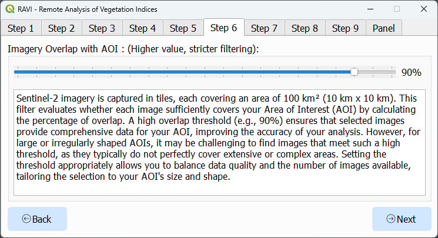

# RAVI - Remote Analysis of Vegetation Indices

RAVI is an QGIS plugin designed to seamlessly integrate with Google Earth Engine (GEE), enabling efficient processing and visualization of geospatial data. With its focus on Sentinel-2 imagery, the plugin supports vegetation index calculations, time series analysis, and interactive visualizations. These features make it an useful tool for students, researchers, farmers, and GIS professionals working in agriculture, land monitoring, or environmental management.

## Key Features

### 1. Earth Engine Integration
- **Easy Authentication**: Authenticate with GEE directly from the plugin interface.
- **Direct Processing**: Access, process, and analyze Sentinel-2 imagery without leaving QGIS.
- **On-the-Fly Visualization**: Visualize processed data as raster layers or interactive plots.

### 2. Vegetation Index Calculations
- **Supported Indices**: Compute indices such as NDVI, EVI, SAVI, GNDVI, and GCI.
- **Customizable Metrics**: Aggregate data using mean, max, min, median, amplitude, or standard deviation.

### 3. Advanced Time Series Analysis
- Generate time series for vegetation indices over a defined Area of Interest (AOI).
- Integrate precipitation data from NASA POWER for cross-variable comparisons.
- Smooth data with Savitzky-Golay filters for enhanced trend analysis.

### 4. AOI and Filtering Tools
- **AOI Management**: Load areas of interest from shapefiles or GeoJSON files.
- **Flexible Filtering**:
  - Set date ranges and cloud coverage thresholds.
  - Apply custom cloud, snow, and shadow masking.

### 5. Interactive Visualization
- **Charts**: Create interactive time series plots using Plotly.
- **Raster Styling**: Apply predefined color ramps (e.g., RdYlGn) for visual clarity.
- **Export Options**: Export processed data as GeoTIFFs, CSVs, or styled rasters.

### 6. Comprehensive Imagery Management
- **Date Filtering**: Filter individual images by acquisition date.
- **Cloud Filtering**: Exclude or mask cloudy pixels while preserving usable data.
- **Composite Creation**: Generate composite images based on user-defined metrics.

## Installation

To install the RAVI QGIS Plugin:

1. Open QGIS and navigate to the **Plugins** menu.
2. Select **Manage and Install Plugins**.
3. Enable **Show also experimental plugins** in the plugin repository settings.
4. Search for "RAVI QGIS Plugin" and click **Install**.
5. Restart QGIS to activate the plugin.

## Usage

### Step 1: Authentication

- Open the plugin dialog.
- Authenticate with Google Earth Engine using your credentials.

### Step 2: Select output folder

- Choose the folder where you want to save the output files.

### Step 3: Load and select the area of interest (AOI)

- Select an AOI by loading a shapefile or GeoJSON file.
- Ensure the geometry is valid (Polygon or MultiPolygon).

### Step 4: Define time range for imagery search

- Set a custom time range or select a suggested one.

### Step 5: Select vegetation index for time series analysis

- Choose the vegetation index you want to analyze from the dropdown menu.

### Step 6: AOI coverage filter and AOI Buffer filter options

- Apply AOI coverage filter to include only images covering a specified percentage of the AOI.
- Use AOI Buffer filter to reduce the AOI boundary for analysis.

### Step 7: Cloud pixel percentage limit and valid pixel percentage threshold in the AOI

- Set the specified filters according to your analysis requirements.

### Results Page

The results page includes the following features:

### 1. Time Series Plot

- Visualize the time series of the selected vegetation index over the defined AOI.
- Hover over the plot to see specific values and dates for detailed analysis.

### 2. Load RGB Layer (Focus on a Day)

- Load and display an RGB layer for a specific date to analyze the visual appearance of the area.

### 3. Load Index Layer (Focus on a Day)

- Load and display a vegetation index layer for a specific date.

### 4. Load Index Layer (Composite Image)

- Generate and display a composite image based on the selected vegetation index and the user-defined metric.
- The composite image will include all images within the current date selection. Use the date selection tool to filter out specific dates.

### 5. Date Selection Tool

- Use the date selection tool to filter and select specific dates for analysis.
- The date selection tool updates the time series plot
- Composite images are based on all selected dates.

### 6. Savitzky-Golay Filter

- Apply the Savitzky-Golay filter to smooth the time series data for enhanced trend analysis.
- The parameters for the Savitzky-Golay algorithm, such as the order of the polynomial and the window length, can be adjusted as needed to fine-tune the smoothing process.

### 7. Save Options

- Save the time series data in spreasheet format (CSV).

- To save the time series plot image, open it in the browser to enable the download option.

### 8. NASA POWER Precipitation

- Add monthly precipitation data from NASA POWER for cross-variable comparisons.

### 9. Clear All Loaded Layers

- Clear all loaded layers from the layer panel to start a new analysis or to declutter the workspace.

## Troubleshooting

- **Earth Engine Authentication Failed**: Ensure you have the necessary requirements as explained in the authentication tab.
- **AOI Errors**: Verify the AOI file is valid and has a valid CRS (EPSG:4326 preferred).

## License

RAVI is licensed under the GNU General Public License v2.0 or later. Refer to the LICENSE file for details.

## Contact

For questions or support, email [Caio Arantes](mailto:caiosimplicioarantes@gmail.com).
