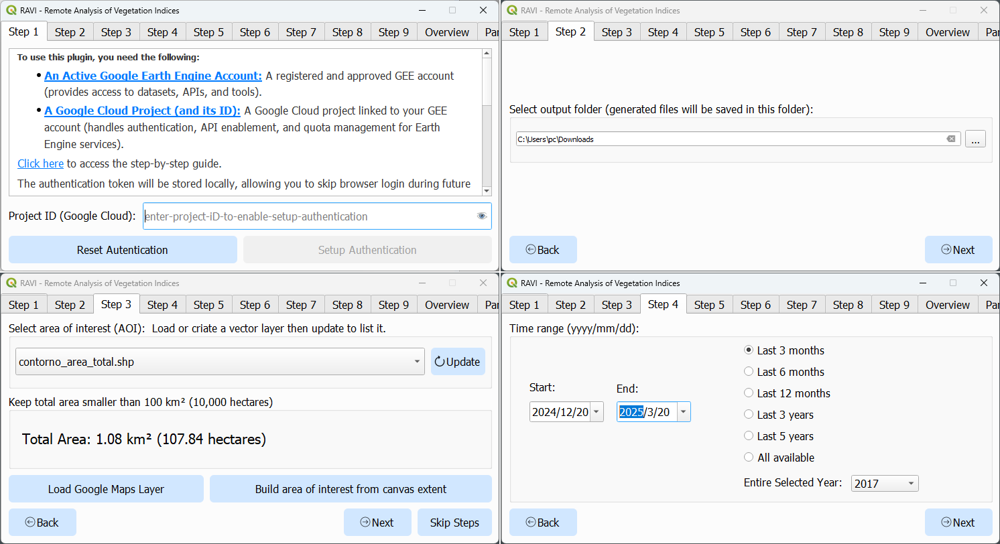

# Summary

O plugin RAVI, desenvolvido para a plataforma QGIS, é uma ferramenta para
agricultura de precisão (AP), monitoramento ambiental e pesquisa científica.
Seu principal objetivo é fornecer uma interface gráfica para processar e
visualizar imagens Sentinel-2 utilizando recursos do Google Earth Engine. Ele
oferece um fluxo de trabalho passo a passo com várias opções para seleção de
AOI, intervalo de tempo, filtragem e visualização. Os resultados demonstram o
potencial do RAVI como uma solução prática e eficiente para análise de índices
de vegetação, especialmente para usuários sem experiência em programação. Ao
simplificar acesso a dados de sensoriamento remoto, o RAVI fortalece a
integração da inovação tecnológica na gestão da vegetação e do solo,
oferecendo dados e insights visuais para estudantes, pesquisadores e
profissionais interessados em compreender e gerir a saúde da vegetação e do
solo de forma baseada em dados. O projeto foi estruturado para atender a
diferentes perfis de usuários, priorizando simplicidade na interface e redução
da complexidade técnica.

Keywords: Índices vegetativos, Agricultura de Precisão, Sensoriamento remoto,
Sistema de Informações Geográficas.

# Statement of need

A agricultura de Precisão (AP) emergiu como uma abordagem transformadora,
permitindo que produtores gerenciarem o uso de insumos, como água,
fertilizantes e defensivos, com base em dados geoespaciais e ambientais (ref
1) (Gebbers & Adamchuk, 2010). Essa prática baseia-se no princípio de que a
variabilidade espacial e temporal das áreas agrícolas deve ser considerada
para maximizar a produtividade e minimizar os impactos ambientais. Tecnologias
como o sensoriamento remoto (SR), veículos aéreos não tripulados (VANTs) e
sistemas de informações geográficas (SIG) têm desempenhado um papel central
na implementação da AP, fornecendo informações detalhadas sobre a saúde da
vegetação, o estado do solo e as condições climáticas (ref 2?).

Entre as ferramentas utilizadas no SR estão os índices espectrais, como o
Índice de Vegetação por Diferença Normalizada (Normalized Difference
Vegetation Index - NDVI), que avalia a saúde e o vigor da vegetação com base
na interação da radiação solar com a biomassa vegetal ref 3 (Xue & Su, 2017).
A disponibilidade de dados de satélites, como os da missão Copernicus
Sentinel-2, combinada com plataformas de processamento em nuvem, como o
Google Earth Engine (GEE), tem revolucionado a forma como os dados de
sensoriamento remoto são acessados e analisados ref 4(Gorelick et al., 2017).
Essas tecnologias permitem análises em tempo quase real, com alta resolução
espacial e temporal, tornando-se ferramentas indispensáveis para a gestão
agrícola e ambiental.

Apesar dessas inovações, o uso efetivo de tecnologias de sensoriamento remoto
ainda enfrenta barreiras significativas. Muitos profissionais, especialmente em
países em desenvolvimento, encontram dificuldades devido à complexidade das
ferramentas disponíveis, à necessidade de conhecimentos avançados em
programação e à falta de acesso a recursos computacionais robustos  (ref?)
Essas limitações restringem a adoção em larga escala de soluções baseadas em
dados, especialmente por pequenos e médios produtores, técnicos agrícolas e
pesquisadores.

Nesse contexto, o plugin RAVI (Remote Analysis of Vegetation Indices) foi
desenvolvido como uma solução prática e acessível para integrar recursos do
Google Earth Engine ao ambiente do QGIS, uma plataforma amplamente utilizada
por profissionais de geotecnologias.

Graphical Interface and functionalities

Dividida em abas (figura 1), a interface segue uma sequência de passos, que
busca explicar o impacto de cada configuração na busca de imagens. A tela
inicial no plugin conta com orientações iniciais para habilitar o acesso,
inclusive um link para acesso ao website dedicado com guias em textos e
vídeos explicativos. As configurações são resumidas na aba Overview (figura 2)

Figure 2: Setting overview

Seleção de áreas de interesse diretamente no QGIS, utilizando camadas
vetoriais existentes ou criando novas.

Busca por imagens Sentinel-2 com filtros por data e cobertura de nuvens.

Download camada de índice de vegetação para a AOI especificada na data
selecionada (figura 3).

Figure 3: Index time series and layer for selected date

Gera gráficos de série temporal do índices de vegetação selecionado.

Exportação dos resultados em formatos CSV ou em imagem png (para séries
temporais), e GeoTIFF (para camadas raster).

Download e visualização e exiba uma camada em cor real para uma data
específica. Todas as bandas espectrais são baixadas, permitindo outras análises.
Os números das bandas correspondem às bandas do Sentinel-2 conforme listado na
documentação.

Geração e Download de imagem sintética baseada no índice de vegetação
selecionado e na métrica definida pelo usuário. A imagem sintética é gerada
com base em todas as imagens que compõem a série temporal.

Ferramenta de remoção de data para filtrar e selecionar datas e períodos
específicos para análise.

Filtro de Savitzky-Golay para suavizar os dados de séries temporais.

A Figura 4 exibe uma camada em cor real para área especificada, obtida pelo
plugin, e a série temporal do índice NDVI um talhão agricultável, a série com
filtro Savitzky-Golay e a precipitação mensal acumulada, obtida por meio da
NASA POWER restful API.

Figure 4: Setting overview

A Figura 5 apresenta um gráfico gerado pelo plugin, exibindo a evolução
temporal do NDVI em uma área específica em comparação a pontos dentro da área.
A figura 6 exibe a série temporal do índice de vegetação da área total em
comparação a áreas menores definidas por cada feição da mesma camada vetorial.

Figure 5: Points Analysis

Figure 6: Multipolygon Analysis

Development Platform and tools

O QGIS foi escolhido como base para o desenvolvimento do RAVI devido à sua
natureza de código aberto, suporte a múltiplos formatos de dados e capacidade
de integração com APIs externas. A plataforma fornece um ambiente flexível para
análise geoespacial e personalização por meio do desenvolvimento de plugins.

O desenvolvimento foi realizado utilizando Python. Os principais recursos
utilizadas foram:

PyQt: Para o desenvolvimento da interface gráfica.
PyQGIS: Para processamento de dados no QGIS.
Google Earth Engine Python API: Para integração com o Google Earth Engine,
possibilitando o acesso aos dados e processamento em nuvem.
Pandas, SciPy, e NumPy: Para manipulação de dados tabulares e cálculos
numéricos.

# Availability

# Acknowledgements

# References
